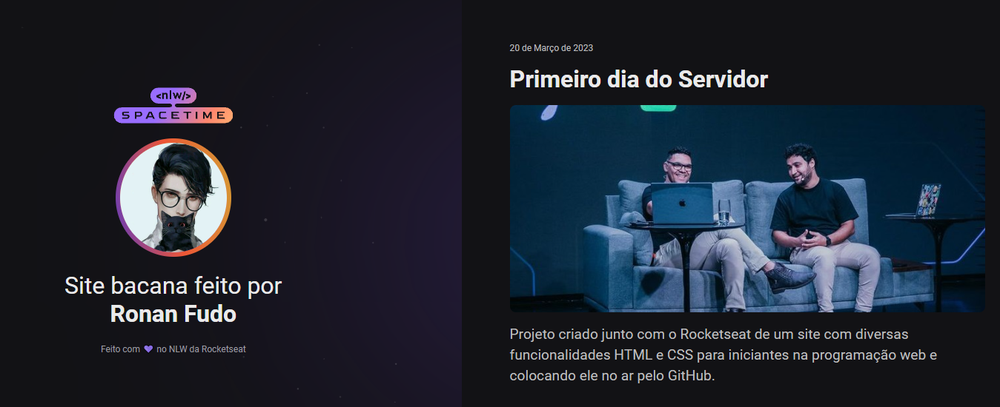

  
  
  

 

<h2>🖥️ Projeto</h2>

Esse é um projeto Web Responsivo de duma cápsula do tempo para exibir memórias em uma linha do tempo.

<h2>🚀 Tecnologias</h2>

Esse Projeto foi desenvolvido durante o NLW da Rocketseat com as seguintes tecnologias:

- HTML
- CSS
- Git e Github

<h2>🏷️ Layout</h2>

Visualize o projeto em <a href="https://whitmanfudo.github.io/nlw-spacetime/">Nesse Link</a>

